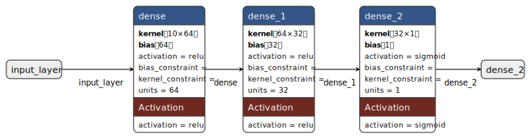
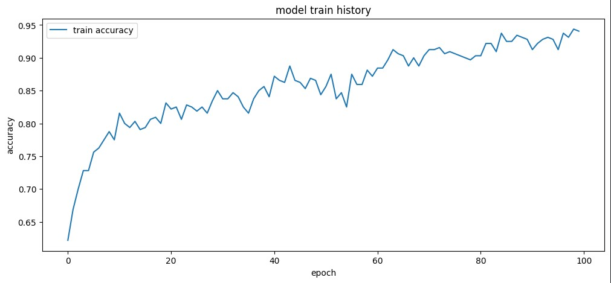

# cs461-population-illness-ml
___
##### Model: **`Sequential`** Structure

<br/>



<br/>

```cpp
_________________________________________________
┃ Layer (type)       ┃ Output Shape ┃ Param #   ┃
_________________________________________________
┃ dense (Hidden 1)   ┃ (None, 64)   ┃ 704       ┃
┃ dense_1 (Hidden 2) ┃ (None, 32)   ┃ 2,080     ┃
┃ dense_2 (Output)   ┃ (None, 1)    ┃ 33        ┃
_________________________________________________
```

<br/>

